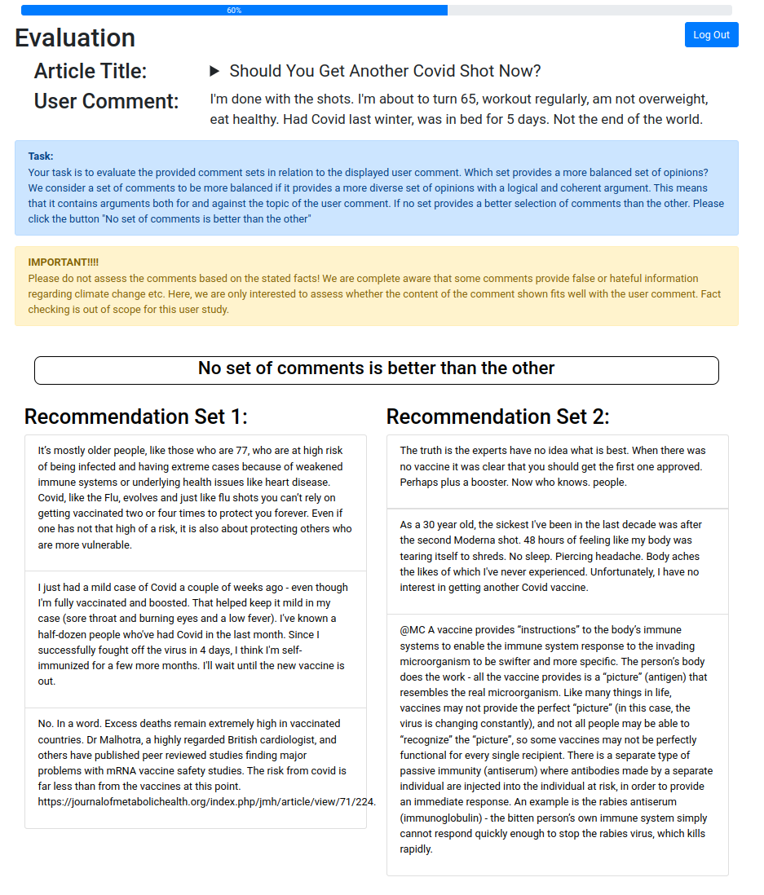

# What-Do-Other-People-Think-About-This--Evaluation-Application

This repository provides the implementation for our assessment tool designed for the paper `What do other people think about this? Recommending Relevant and Diverse User Comments in Comment sections`. This Django-based web application allows users to participate from any location of their preference. Moreover, it offers the capability for users to halt their evaluation process and continue it at a later point. The application obtains recommendations for participants to assess by accessing the REST API of our deployed recommendation model. To enable this, a CSV file with user comments is provided to the application, which the recommendation model uses to produce the recommendations.

The paper outlines the evaluation methodology, which comprises two stages. Initially, participants individually examine and scrutinize each recommendation to determine if the particular recommendation effectively corresponds to the user's comment.


During the second stage, the participants thoroughly assess the entire collection of recommendations and compare them to a randomly selected set of recommendations from the same article. This comparison aims to determine whether the collection reflects more diverse perspectives as the random recommendations.


## Setup
Ensure that the following tools are installed:
* Docker
* Docker-Compose
* Python >= 3.10

## Environment Variables
The framework need some environment variables to be set for running properly. Please ensure that you have an ```.env```
file with the following variables:

* DB_ENGINE=django.db.backends.postgresql_psycopg2
* DB_USER
* DB_PASSWORD
* SECRET_KEY
* DB_NAME
* DB_HOST
* DB_PORT=5432
* GITLAB=false
* DEBUG=false
* SEED
* ADMIN_URL


# Maintainers:
* Jan Steimann

# Contributers: 
* Jan Steimann

## License:
Copyright(c) 2025 - today Anonymous

Distributed under the [MIT License](LICENSE)
